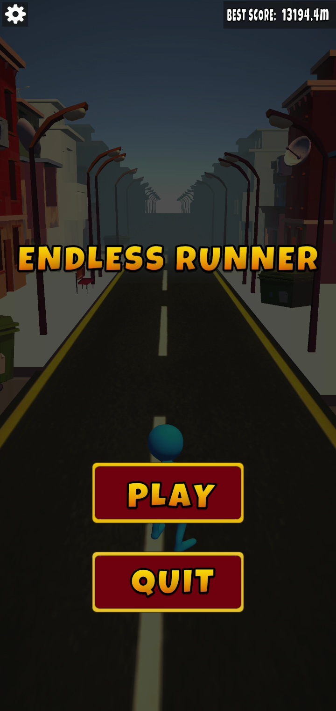
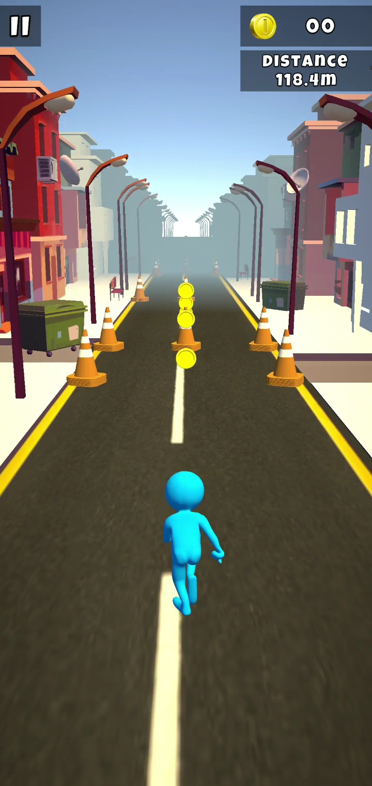
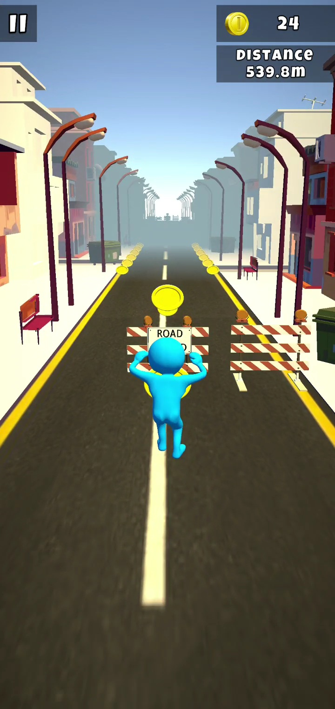
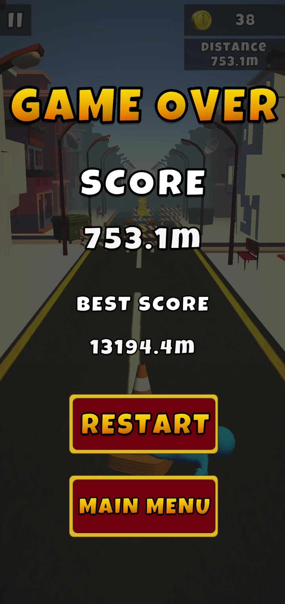
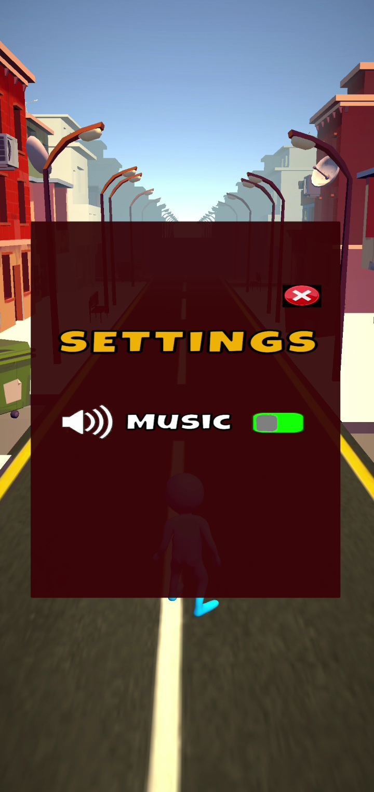

# 3D Endless Runner Game

A fun, fast-paced 3D Endless Runner game developed in Unity using C#. The player must run endlessly, avoid obstacles, collect coins, and survive as long as possible to achieve the highest score.

---

##  Features
* **Procedural Level Generation:** Levels and obstacles generate dynamically as the player moves forward.
* **Score & Coin System:** Fully functional system to track collected coins and calculate the high score.
* **Smooth Character Controls:** Responsive movement (Left/Right lanes, Jump, and Slide).
* **Increasing Difficulty:** The game speed gradually increases over time to challenge the player.

---

##  Tech Stack & Tools
* **Game Engine:** Unity (3D)
* **Language:** C#
* **Version Control:** Git & GitHub

---

## 🎮 How to Play
* **A / D** or **Left / Right Arrow Keys** – Change Lanes
* **W** or **Up Arrow Key / Spacebar** – Jump
* **S** or **Down Arrow Key** – Slide / Duck

---

## 📷 Gameplay Preview

  
   
   
   
   
   
   
   

---

### [Watch the Gameplay Video on Youtube](https://youtube.com/shorts/MjMaPt7nVPA?si=PkVaeAM-3ADs-Nq6)
